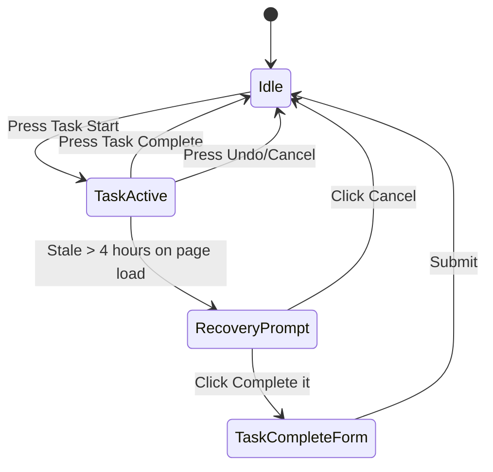
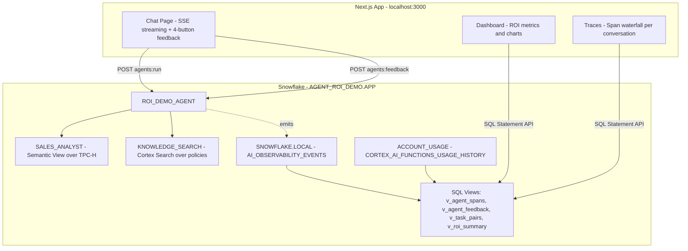

# Plan: Agent ROI Demo

## Context

**Account:** SFSENORTHAMERICA-DEMO\_IND\_PNANISETTY (XFB07251), role ACCOUNTADMIN.

**Confirmed permissions:**

- CREATE DATABASE/SCHEMA/WAREHOUSE/AGENT — full admin
- SNOWFLAKE.ACCOUNT\_USAGE.CORTEX\_AI\_FUNCTIONS\_USAGE\_HISTORY — 1,348 rows already
- SNOWFLAKE.LOCAL.AI\_OBSERVABILITY\_EVENTS — 6,915 rows from existing agents
- Existing agents use Cortex Analyst + Search tools successfully

**TPC-H data source:** `SFSALESSHARED_SFC_SAMPLES_PROD3_SAMPLE_DATA.TPCH_SF1` — confirmed available with 1.5M orders, 150K customers, 25 nations, 6M line items.

**Project location:** New database `AGENT_ROI_DEMO` with schema `APP`.

---

## Feedback Model (Four-Button System)

### Buttons and behavior

| Button        | When shown                            | Captures              | Optional inputs (all optional)                                                                                                               |
| ------------- | ------------------------------------- | --------------------- | -------------------------------------------------------------------------------------------------------------------------------------------- |
| Thumbs Up     | Per message, after response completes | Quality signal        | Stars 1-5 ("How useful?"), optional comment                                                                                                  |
| Thumbs Down   | Per message, after response completes | Quality signal        | Category pills (multi-select), optional comment                                                                                              |
| Task Start    | Always visible in idle state          | Workflow start marker | Optional task description                                                                                                                    |
| Task Complete | Only visible when task is active      | Workflow outcome      | Stars 1-5, value (Low/Medium/High/Critical), time saved (< 5 min / 5-15 / 15-30 / 30-60 / 1+ hr), fully automated (yes/no), optional comment |

### Thumbs-down category pills (multi-select)

- Wrong answer
- Incomplete
- Hallucination
- Too slow
- Wrong tool used
- Confusing

### Task state machine



**While task is active:**

- Task Start button: disabled
- Small "Task in progress" indicator shown with elapsed time
- "Undo" link visible (cancels the task)
- Thumbs up/down still work normally (per-message quality)
- Task Complete button: enabled

**State persistence:** React state + localStorage (survives page refresh). On page load, check if a task is open and if it's stale (> 4 hours) — show recovery prompt.

### API mapping

All four buttons use the same Feedback REST API with structured `categories`:

```json
// Thumbs up
{ "orig_request_id": "abc", "positive": true, "categories": ["stars:4"], "feedback_message": "Great breakdown" }

// Thumbs down
{ "orig_request_id": "abc", "positive": false, "categories": ["Wrong answer", "Incomplete"], "feedback_message": "Revenue was wrong" }

// Task start
{ "orig_request_id": "abc", "positive": true, "categories": ["task:start"], "feedback_message": "Analyzing Q3 regional revenue" }

// Task complete
{ "orig_request_id": "abc", "positive": true, "categories": ["task:complete", "stars:5", "value:High", "time_saved:15-30 min", "automated:yes"], "feedback_message": "" }

// Task cancelled (undo)
{ "orig_request_id": "abc", "positive": true, "categories": ["task:cancelled"], "feedback_message": "" }
```

### Task states in telemetry

| Pattern                                       | Meaning              | ROI treatment                              |
| --------------------------------------------- | -------------------- | ------------------------------------------ |
| `task:start` + `task:complete` (same thread)  | Valid completed task | Included in ROI                            |
| `task:start` + `task:cancelled` (same thread) | Mistaken start       | Excluded entirely                          |
| `task:start` with no pair within 24h          | Abandoned            | Excluded from ROI; shown as "abandon rate" |

---

## ROI Formula

```
ROI Score = (Completed Tasks x Avg Task Value x Automation Rate) / Total Credits Consumed

Where:
  Completed Tasks  = count of task:complete events
  Avg Task Value   = weighted average from value field (Low=1, Medium=2, High=3, Critical=4)
  Automation Rate  = task:complete where automated=yes / total task:complete
  Total Credits    = sum from CORTEX_AI_FUNCTIONS_USAGE_HISTORY for agent queries
```

Secondary metrics (per-message quality):

- Positive Rate = thumbs\_up / (thumbs\_up + thumbs\_down)
- Error Rate = (sql\_failures + tool\_errors + replans) / total\_spans
- Abandon Rate = orphan task:start / all task:start

---

## Architecture



---

## Implementation Steps

### Step 1: Snowflake Infrastructure

**File: `snowflake/01_setup.sql`**

```sql
CREATE DATABASE AGENT_ROI_DEMO;
CREATE SCHEMA AGENT_ROI_DEMO.APP;
CREATE WAREHOUSE AGENT_ROI_WH
  WAREHOUSE_SIZE = 'XSMALL' AUTO_SUSPEND = 60 AUTO_RESUME = TRUE;
```

### Step 2: Sample Data from TPC-H

**File: `snowflake/02_sample_data.sql`**

```sql
CREATE OR REPLACE TABLE AGENT_ROI_DEMO.APP.ORDERS AS
SELECT O_ORDERKEY AS order_id, O_CUSTKEY AS customer_id,
       O_TOTALPRICE AS total_price, O_ORDERDATE AS order_date,
       O_ORDERSTATUS AS status, O_ORDERPRIORITY AS priority
FROM SFSALESSHARED_SFC_SAMPLES_PROD3_SAMPLE_DATA.TPCH_SF1.ORDERS
SAMPLE (50000 ROWS);

CREATE OR REPLACE TABLE AGENT_ROI_DEMO.APP.CUSTOMERS AS
SELECT C_CUSTKEY AS customer_id, C_NAME AS name, C_MKTSEGMENT AS market_segment,
       C_NATIONKEY AS nation_key, C_ACCTBAL AS account_balance
FROM SFSALESSHARED_SFC_SAMPLES_PROD3_SAMPLE_DATA.TPCH_SF1.CUSTOMER;

CREATE OR REPLACE TABLE AGENT_ROI_DEMO.APP.NATIONS AS
SELECT N_NATIONKEY AS nation_key, N_NAME AS nation_name, N_REGIONKEY AS region_key
FROM SFSALESSHARED_SFC_SAMPLES_PROD3_SAMPLE_DATA.TPCH_SF1.NATION;

CREATE OR REPLACE TABLE AGENT_ROI_DEMO.APP.REGIONS AS
SELECT R_REGIONKEY AS region_key, R_NAME AS region_name
FROM SFSALESSHARED_SFC_SAMPLES_PROD3_SAMPLE_DATA.TPCH_SF1.REGION;
```

### Step 3: Knowledge Base Documents

**File: `snowflake/03_knowledge_docs.sql`**

\~20 policy/FAQ documents covering shipping, refunds, order priority, account policies, market segment definitions.

### Step 4: Semantic View for Cortex Analyst

**File: `snowflake/04_semantic_view.sql`**

- Entities: orders, customers, nations, regions
- Dimensions: order\_date, status, priority, nation\_name, region\_name, market\_segment
- Metrics: total\_revenue, order\_count, avg\_order\_value, customer\_count
- Joins: orders -> customers -> nations -> regions
- Verified queries: 5-8 sample questions

### Step 5: Cortex Search Service

**File: `snowflake/05_search_service.sql`**

```sql
CREATE OR REPLACE CORTEX SEARCH SERVICE AGENT_ROI_DEMO.APP.KNOWLEDGE_SEARCH
  ON content
  ATTRIBUTES title, category
  WAREHOUSE = AGENT_ROI_WH
  TARGET_LAG = '1 hour'
AS SELECT doc_id, title, category, content
   FROM AGENT_ROI_DEMO.APP.KNOWLEDGE_DOCS;
```

### Step 6: Cortex Agent

**File: `snowflake/06_agent.sql`**

Agent with SALES\_ANALYST (text-to-sql) and KNOWLEDGE\_SEARCH (cortex\_search) tools.

### Step 7: ROI Telemetry SQL Views

**File: `snowflake/07_roi_views.sql`**

Five views:

**`v_agent_spans`** — parsed span-level data:

- request\_id, span\_kind, tool\_name, span\_duration\_ms, has\_error, is\_replan, error\_message

**`v_agent_feedback`** — all feedback events parsed:

- request\_id, thread\_id, positive, stars, categories, value, time\_saved, automated, feedback\_message, event\_type (thumbs\_up/thumbs\_down/task\_start/task\_complete/task\_cancelled)

**`v_task_pairs`** — matched task start/complete pairs by thread\_id:

- thread\_id, started\_at, completed\_at, duration\_seconds, stars, value, time\_saved, automated, status (completed/cancelled/abandoned)

**`v_agent_costs`** — credit consumption:

- query\_id, credits, model\_name, function\_name

**`v_roi_summary`** — hourly aggregate with ROI score:

- completed\_tasks, avg\_task\_value, automation\_rate, total\_credits
- positive\_rate, error\_rate, abandon\_rate, roi\_score

### Step 8: Next.js App Scaffold

**Directory: `app/`**

```
app/
├── src/
│   ├── app/
│   │   ├── layout.tsx
│   │   ├── page.tsx                 → Redirect to /chat
│   │   ├── chat/page.tsx
│   │   ├── dashboard/page.tsx
│   │   └── traces/page.tsx
│   ├── components/
│   │   ├── ChatInterface.tsx        → Message list + input + streaming
│   │   ├── MessageBubble.tsx        → Message display
│   │   ├── FeedbackButtons.tsx      → Thumbs up/down per message
│   │   ├── TaskControls.tsx         → Task Start/Complete/Undo bar
│   │   ├── ThumbsUpForm.tsx         → Stars + optional comment
│   │   ├── ThumbsDownForm.tsx       → Category pills + optional comment
│   │   ├── TaskCompleteForm.tsx     → Stars, value, time saved, automated, comment
│   │   ├── TaskProgressBanner.tsx   → "Task in progress" indicator + undo link
│   │   ├── RecoveryPrompt.tsx       → Stale task prompt on page load
│   │   ├── MetricCard.tsx           → KPI tile
│   │   ├── ROIChart.tsx             → Time-series charts
│   │   └── SpanWaterfall.tsx        → Trace waterfall
│   ├── lib/
│   │   ├── snowflake-auth.ts        → PAT auth headers
│   │   ├── snowflake-agent.ts       → Agent run (SSE) + feedback
│   │   ├── snowflake-sql.ts         → SQL Statement API
│   │   ├── task-state.ts            → Task state machine + localStorage
│   │   └── roi-utils.ts             → ROI formula helpers
│   └── types/
│       └── index.ts
├── .env.local.example
├── package.json
├── tailwind.config.ts
└── tsconfig.json
```

### Step 9: Chat Page with Four-Button Feedback

**Core behavior:**

- Message stream via SSE; capture `X-Snowflake-Request-ID` per response
- Per-message: thumbs up (expands star picker + comment) / thumbs down (expands category pills + comment)
- Task bar at top: Task Start button (when idle) / "Task in progress 00:05:32" + Undo link + Task Complete button (when active)
- On page load: check localStorage for stale task (>4h) — show RecoveryPrompt
- All form inputs are optional — clicking the button itself immediately fires the minimum API call

### Step 10: ROI Dashboard Page

Five metric cards:

1. **Completed Tasks** — from v\_task\_pairs WHERE status = 'completed'
2. **Avg Credits / Task** — total credits / completed tasks
3. **Automation Rate** — tasks where automated = yes / total completed
4. **Positive Feedback %** — thumbs\_up / (thumbs\_up + thumbs\_down)
5. **ROI Score** — composite formula, color-coded

Three charts:

- **Line chart:** ROI score trend over time (daily buckets)
- **Bar chart:** Credits consumed per day with task completion count overlay
- **Breakdown:** Task value distribution (Low/Medium/High/Critical) as a donut chart

### Step 11: Trace Explorer Page

Left panel: conversation list (request\_id, first message, feedback indicators, task status badge) Right panel: span waterfall with errors (red) and re-plans (amber), plus associated feedback events inline

### Step 12: Documentation

**File: `docs/roi-methodology.md`**

- Four-button feedback model explanation
- Task lifecycle (start/complete/cancelled/abandoned)
- ROI formula with per-component explanation
- Error taxonomy
- Data sources and latency
- Extension points

---

## Critical Files

- `snowflake/07_roi_views.sql` — Core telemetry views including task pair matching
- `app/src/lib/task-state.ts` — Task state machine with localStorage persistence and recovery
- `app/src/lib/snowflake-agent.ts` — REST client for agent SSE + feedback calls
- `app/src/components/TaskControls.tsx` — Task Start/Complete/Undo UI orchestration
- `app/src/app/dashboard/page.tsx` — ROI dashboard with task-based metrics

---

## Verification Steps

1. Run SQL scripts 01-06; confirm agent exists with `SHOW AGENTS IN SCHEMA AGENT_ROI_DEMO.APP`.
2. Send test questions; confirm spans in GET\_AI\_OBSERVABILITY\_EVENTS.
3. Submit thumbs-up with stars via REST; confirm event stored with `categories: ["stars:4"]`.
4. Submit task:start then task:complete via REST; confirm both events stored.
5. Query v\_task\_pairs; confirm the pair is matched with correct duration.
6. Submit task:start then task:cancelled; confirm it appears as cancelled (excluded from ROI).
7. `npm run dev`; verify chat streams correctly.
8. Click Task Start → verify button disables, timer shows, undo link appears.
9. Click Task Complete → verify form appears, submit, verify state resets to idle.
10. Open /dashboard; confirm ROI score and task metrics render.
11. Close browser with active task, reopen → verify recovery prompt appears.
