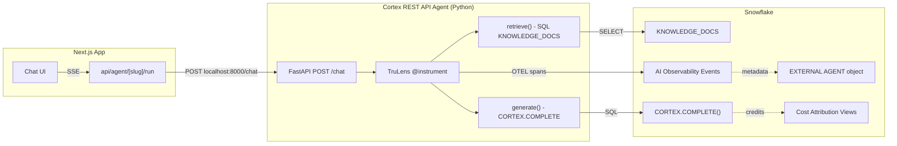

# Plan: Cortex REST API Agent with TruLens Telemetry

## Context

We are building a new agent type called `cortex_rest_api` that represents a Python application which:
- Runs locally as a FastAPI server
- Uses Snowflake resources (Cortex COMPLETE, SQL queries against tables)
- Is instrumented with TruLens to emit OTEL spans to Snowflake as `EXTERNAL AGENT`
- Has full cost attribution (credits, query stats, warehouse metering) since it uses Snowflake infrastructure

This is distinct from a future "true external agent" which would use a local LLM with zero Snowflake resource consumption.

### Agent Type Taxonomy (Updated)

| Type | Label in UI | Telemetry Source | Cost Attribution |
|------|-------------|-----------------|-----------------|
| `cortex_agent` | Cortex Agent | `GET_AI_OBSERVABILITY_EVENTS(..., 'CORTEX AGENT')` | Full (auto-attributed) |
| `cortex_rest_api` | Cortex REST API Agent | `GET_AI_OBSERVABILITY_EVENTS(..., 'EXTERNAL AGENT')` | Full (CORTEX_AI_FUNCTIONS + QUERY_HISTORY + WAREHOUSE_METERING) |
| `external_agent` | External Agent | `GET_AI_OBSERVABILITY_EVENTS(..., 'EXTERNAL AGENT')` or none | None/partial (future) |

### Architecture



### Cost Attribution Strategy

Since this agent uses Snowflake resources, we can attribute costs from three sources:

1. **CORTEX_AI_FUNCTIONS_USAGE_HISTORY** -- Credits consumed by `CORTEX.COMPLETE()` calls. Filter by `FUNCTION_NAME = 'COMPLETE'` and time window matching the trace timestamps.

2. **QUERY_HISTORY** -- Execution stats for the retrieval SQL (bytes scanned, compile time, exec time, partitions). We can correlate by query_id captured in the agent's spans, or by user + time window.

3. **WAREHOUSE_METERING_HISTORY** -- Warehouse credits consumed during the agent's activity window. Filter by the warehouse used (`AGENT_ROI_WH`) and time range.

For the dashboard, we'll add a cost breakdown section specific to `cortex_rest_api` agents that shows:
- Credits per call (from CORTEX_AI_FUNCTIONS)
- Avg query execution time (from QUERY_HISTORY)
- Warehouse cost (from WAREHOUSE_METERING)

### Telemetry Flow (No Duplication)

- **TruLens OTEL spans** go to `GET_AI_OBSERVABILITY_EVENTS(..., 'EXTERNAL AGENT')` -- full trace tree
- **Cortex COMPLETE credits** go to `CORTEX_AI_FUNCTIONS_USAGE_HISTORY` -- correlatable by time window
- **Query stats** go to `QUERY_HISTORY` -- correlatable by query_id (logged in spans)
- These are **complementary** data sources, not duplicates

---

## Implementation Steps

### Step 1: Create Python venv and install dependencies

Create `external-agent/` directory with:
```bash
python3 -m venv .venv
source .venv/bin/activate
pip install fastapi uvicorn snowflake-snowpark-python \
    trulens-core trulens-connectors-snowflake
pip freeze > requirements.txt
```

### Step 2: Create EXTERNAL AGENT object in Snowflake

**File: `snowflake/12_external_agent.sql`**

```sql
CREATE EXTERNAL AGENT IF NOT EXISTS AGENT_ROI_DEMO.APP.KNOWLEDGE_RAG_AGENT;
```

This is the metadata anchor that TruLens references when exporting spans.

### Step 3: Build the RAG agent module

**File: `external-agent/agent.py`**

- `retrieve(query)` -- SQL search on KNOWLEDGE_DOCS (ILIKE match), returns top 3 docs as context string
- `generate(query, context)` -- Calls `SELECT SNOWFLAKE.CORTEX.COMPLETE('llama3.1-8b', prompt)` via Snowpark
- `__call__(query)` -- Orchestrates retrieve -> generate
- Each method uses `@instrument` for TruLens span creation
- Captures `query_id` from Snowpark result metadata for cost correlation

### Step 4: Build the FastAPI server with SSE streaming

**File: `external-agent/server.py`**

- `POST /chat` -- Accepts `{"messages": [...]}`, extracts last user message
- Returns `StreamingResponse` with `text/event-stream`
- Emits Cortex Agent-compatible SSE format:
  - `event: response.status` during retrieval
  - `event: response.text.delta` for each text chunk
  - `event: done` at end
- Chunks the full response into ~30-char pieces with 20ms delays for streaming UX

### Step 5: Configure TruLens Snowflake OTEL export

**File: `external-agent/config.py`**

- Initialize `SnowflakeConnector` with OAuth token (reads from `~/.snowflake/tokens/`)
- Initialize `TruSession` -- this automatically sets up the OTEL span exporter
- Create `TruApp` wrapper around the agent class
- `use_account_event_table=True` (default) ensures spans route through `SYSTEM$EXECUTE_AI_OBSERVABILITY_RUN`

### Step 6: Add `cortex_rest_api` agent type to data model

Update the following files:
- `app/src/types/index.ts` -- Add `'cortex_rest_api'` to the `agent_type` union
- `app/src/app/config/page.tsx` -- Add third option in agent type dropdown with label "Cortex REST API Agent", show Cortex-specific fields (same as cortex_agent section) PLUS endpoint_url field
- `app/src/app/api/agent/[slug]/run/route.ts` -- Handle `cortex_rest_api` type same as `external_agent` (calls endpoint_url)
- `app/src/app/traces/page.tsx` -- Map `cortex_rest_api` to `'EXTERNAL AGENT'` type in SQL queries
- `app/src/lib/agent-registry.ts` -- No change needed (string field)

### Step 7: Register agent in AGENT_REGISTRY and agents.json

SQL insert + local JSON update with:
- `name`: "Knowledge RAG Agent"
- `slug`: "knowledge-rag-agent"
- `agent_type`: "cortex_rest_api"
- `mode`: "live_chat"
- `endpoint_url`: "http://localhost:8000/chat"
- `obs_database`: "AGENT_ROI_DEMO"
- `obs_schema`: "APP"
- `obs_agent_name`: "KNOWLEDGE_RAG_AGENT"

### Step 8: Test end-to-end with cost verification

1. Start agent: `cd external-agent && source .venv/bin/activate && python server.py`
2. In chat UI: select "Knowledge RAG Agent", ask "What is the refund policy?"
3. Verify SSE streaming works in the chat
4. Check Snowflake:
   ```sql
   -- Verify spans exported
   SELECT * FROM TABLE(SNOWFLAKE.LOCAL.GET_AI_OBSERVABILITY_EVENTS(
     'AGENT_ROI_DEMO', 'APP', 'KNOWLEDGE_RAG_AGENT', 'EXTERNAL AGENT'
   )) ORDER BY TIMESTAMP DESC LIMIT 20;

   -- Verify Cortex COMPLETE credits
   SELECT * FROM SNOWFLAKE.ACCOUNT_USAGE.CORTEX_AI_FUNCTIONS_USAGE_HISTORY
   WHERE FUNCTION_NAME = 'COMPLETE'
   ORDER BY END_TIME DESC LIMIT 5;

   -- Verify query history for retrieval
   SELECT QUERY_ID, QUERY_TEXT, EXECUTION_TIME, BYTES_SCANNED
   FROM SNOWFLAKE.ACCOUNT_USAGE.QUERY_HISTORY
   WHERE QUERY_TEXT ILIKE '%KNOWLEDGE_DOCS%'
   ORDER BY END_TIME DESC LIMIT 5;
   ```
5. Navigate to Traces page, filter by "Knowledge RAG Agent", verify Gantt chart shows retrieve + generate spans

---

## Directory Structure

```
agent_roi/
├── app/                          (existing Next.js app)
├── snowflake/
│   └── 12_external_agent.sql     (CREATE EXTERNAL AGENT)
└── external-agent/
    ├── .venv/                    (Python virtual environment)
    ├── requirements.txt
    ├── config.py                 (Snowflake connection + TruSession init)
    ├── agent.py                  (RAG logic with @instrument)
    └── server.py                 (FastAPI /chat with SSE streaming)
```

---

## Critical Files

- `external-agent/server.py` -- FastAPI SSE server, the endpoint the Next.js app calls
- `external-agent/agent.py` -- RAG logic with TruLens @instrument decorators and query_id capture
- `external-agent/config.py` -- SnowflakeConnector + TruSession initialization
- `app/src/app/config/page.tsx` -- Updated with "Cortex REST API Agent" type option
- `app/src/app/traces/page.tsx` -- Maps cortex_rest_api to 'EXTERNAL AGENT' in SQL queries
