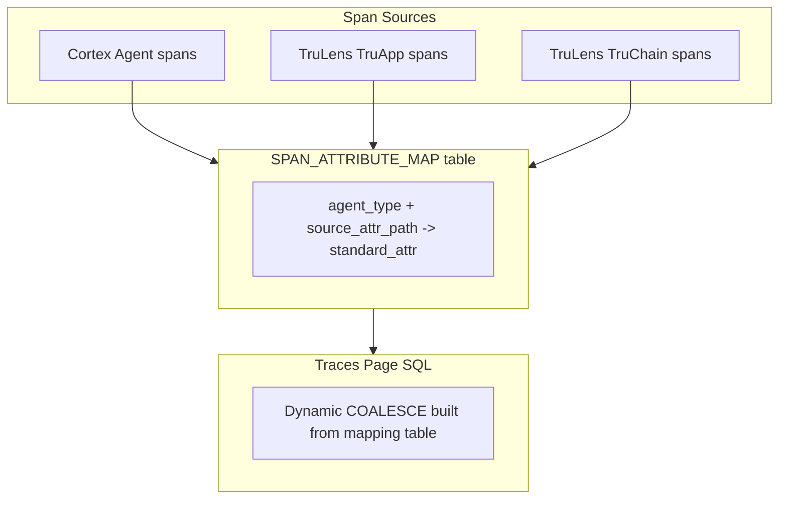
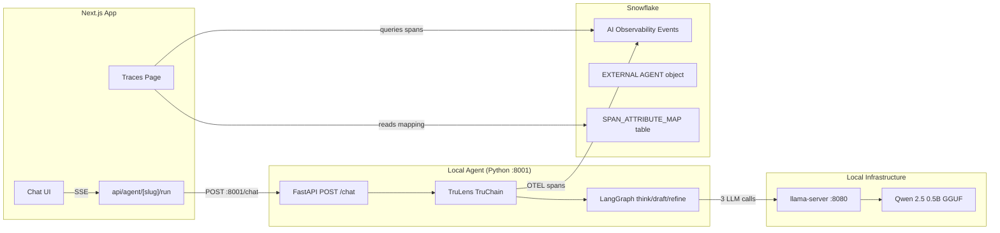

# Plan: Local LLM Agent + Telemetry Attribute Mapping

## Context

This plan has two parts:

1. **Local LLM Agent** — LangGraph with think/draft/refine nodes, llama-server, TruLens TruChain
2. **Telemetry Attribute Mapping** — A Snowflake mapping table + refactored traces SQL that normalizes span attributes from different sources into a standard schema

### The Problem

Different agent types emit telemetry with different attribute naming conventions:

| Source                     | Model attribute                                    | Query attribute                              | Token count                                              |
| -------------------------- | -------------------------------------------------- | -------------------------------------------- | -------------------------------------------------------- |
| Cortex Agent               | `snow.ai.observability.agent.planning.model`       | `snow.ai.observability.agent.planning.query` | `snow.ai.observability.agent.planning.token_count.input` |
| TruLens TruApp             | `model`                                            | `query`                                      | (not available)                                          |
| TruLens TruChain/LangChain | `trulens.llm.model_name` or `gen_ai.request.model` | `trulens.input`                              | `gen_ai.usage.input_tokens`                              |
| Raw OTEL                   | varies                                             | varies                                       | varies                                                   |

Currently the traces page SQL uses a growing chain of `COALESCE` calls to check each possible attribute name. This doesn't scale as we add more agent types.

### The Solution: Attribute Mapping Table



**Table: `AGENT_ROI_DEMO.APP.SPAN_ATTRIBUTE_MAP`**

| standard\_attr | agent\_type       | source\_attr\_path                                       | priority |
| -------------- | ----------------- | -------------------------------------------------------- | -------- |
| model          | cortex\_agent     | snow\.ai.observability.agent.planning.model              | 1        |
| model          | cortex\_rest\_api | model                                                    | 1        |
| model          | external\_agent   | gen\_ai.request.model                                    | 1        |
| model          | external\_agent   | trulens.llm.model\_name                                  | 2        |
| query          | cortex\_agent     | snow\.ai.observability.agent.planning.query              | 1        |
| query          | cortex\_rest\_api | query                                                    | 1        |
| query          | external\_agent   | trulens.input                                            | 1        |
| sql\_query     | cortex\_agent     | snow\.ai.observability.agent.tool.sql\_execution.query   | 1        |
| sql\_query     | cortex\_rest\_api | sql\_query                                               | 1        |
| tokens\_input  | cortex\_agent     | snow\.ai.observability.agent.planning.token\_count.input | 1        |
| tokens\_input  | external\_agent   | gen\_ai.usage.input\_tokens                              | 1        |
| ...            | ...               | ...                                                      | ...      |

The traces page reads this mapping at load time and builds its span detail queries dynamically, using `COALESCE` ordered by priority.

---

## Architecture



---

## Implementation Steps

### Step 1: Install llama-server and download model

```bash
brew install llama.cpp
mkdir -p ~/models
curl -L -o ~/models/qwen2.5-0.5b-instruct-q4_k_m.gguf \
  "https://huggingface.co/Qwen/Qwen2.5-0.5B-Instruct-GGUF/resolve/main/qwen2.5-0.5b-instruct-q4_k_m.gguf"
```

Start: `llama-server -m ~/models/qwen2.5-0.5b-instruct-q4_k_m.gguf --port 8080 -c 2048 --n-gpu-layers 99`

### Step 2: Create EXTERNAL AGENT object and attribute mapping table

**File: `snowflake/13_local_agent.sql`**

```sql
-- External Agent object
CREATE EXTERNAL AGENT IF NOT EXISTS AGENT_ROI_DEMO.APP.LOCAL_QA_AGENT;
ALTER EXTERNAL AGENT AGENT_ROI_DEMO.APP.LOCAL_QA_AGENT ADD VERSION V1;

-- Telemetry Attribute Mapping Table
CREATE TABLE IF NOT EXISTS AGENT_ROI_DEMO.APP.SPAN_ATTRIBUTE_MAP (
  id INTEGER AUTOINCREMENT,
  standard_attr VARCHAR NOT NULL,    -- normalized name (model, query, sql_query, tokens_input, etc.)
  agent_type VARCHAR NOT NULL,       -- cortex_agent | cortex_rest_api | external_agent
  source_attr_path VARCHAR NOT NULL, -- the actual RECORD_ATTRIBUTES key path
  priority INTEGER DEFAULT 1,        -- lower = tried first in COALESCE
  description VARCHAR
);

-- Seed with known mappings
INSERT INTO SPAN_ATTRIBUTE_MAP (standard_attr, agent_type, source_attr_path, priority, description) VALUES
-- Model
('model', 'cortex_agent', 'snow.ai.observability.agent.planning.model', 1, 'Cortex Agent planning model'),
('model', 'cortex_rest_api', 'model', 1, 'Custom attribute from @instrument'),
('model', 'external_agent', 'gen_ai.request.model', 1, 'OpenTelemetry GenAI semantic convention'),
('model', 'external_agent', 'trulens.llm.model_name', 2, 'TruLens LLM model name'),
-- User query
('query', 'cortex_agent', 'snow.ai.observability.agent.planning.query', 1, 'Cortex planning query'),
('query', 'cortex_rest_api', 'query', 1, 'Custom attribute'),
('query', 'external_agent', 'trulens.input', 1, 'TruLens chain input'),
-- SQL query
('sql_query', 'cortex_agent', 'snow.ai.observability.agent.tool.sql_execution.query', 1, NULL),
('sql_query', 'cortex_agent', 'snow.ai.observability.agent.tool.sql_execution.final_sql', 2, NULL),
('sql_query', 'cortex_rest_api', 'sql_query', 1, NULL),
-- Status
('status', 'cortex_agent', 'snow.ai.observability.agent.planning.status', 1, NULL),
('status', 'cortex_agent', 'snow.ai.observability.agent.tool.cortex_search.status', 2, NULL),
('status', 'cortex_agent', 'snow.ai.observability.agent.tool.sql_execution.status', 3, NULL),
('status', 'cortex_rest_api', 'status', 1, NULL),
('status', 'external_agent', 'trulens.status', 1, NULL),
-- Tokens
('tokens_input', 'cortex_agent', 'snow.ai.observability.agent.planning.token_count.input', 1, NULL),
('tokens_input', 'external_agent', 'gen_ai.usage.input_tokens', 1, NULL),
('tokens_output', 'cortex_agent', 'snow.ai.observability.agent.planning.token_count.output', 1, NULL),
('tokens_output', 'external_agent', 'gen_ai.usage.output_tokens', 1, NULL),
-- Thinking/reasoning
('thinking', 'cortex_agent', 'snow.ai.observability.agent.planning.thinking_response', 1, NULL),
('thinking', 'external_agent', 'trulens.thinking', 1, NULL),
-- Response preview
('response_preview', 'cortex_agent', 'snow.ai.observability.agent.planning.response', 1, NULL),
('response_preview', 'external_agent', 'trulens.output', 1, NULL),
('response_preview', 'cortex_rest_api', 'response_preview', 1, NULL),
-- Search
('search_query', 'cortex_agent', 'snow.ai.observability.agent.tool.cortex_search.query', 1, NULL),
('search_query', 'cortex_rest_api', 'query', 2, 'Reuse query attr for search spans'),
-- Num rows / docs
('num_rows', 'cortex_agent', 'snow.ai.observability.agent.tool.sql_execution.result.num_rows', 1, NULL),
('num_rows', 'cortex_rest_api', 'num_docs_retrieved', 1, NULL),
-- Query ID
('query_id', 'cortex_agent', 'snow.ai.observability.agent.tool.sql_execution.query_id', 1, NULL),
-- Semantic model / table
('semantic_model', 'cortex_agent', 'snow.ai.observability.agent.tool.cortex_analyst.semantic_model', 1, NULL),
('semantic_model', 'cortex_rest_api', 'table', 1, NULL);
```

### Step 3: Create API route to serve the mapping

**File: `app/src/app/api/telemetry-map/route.ts`**

A simple GET route that queries `SPAN_ATTRIBUTE_MAP` and returns the mapping grouped by `standard_attr`. The traces page fetches this on mount and uses it to build dynamic COALESCE expressions.

```typescript
// GET /api/telemetry-map
// Returns: { mappings: { model: [{agent_type, source_attr_path, priority}], query: [...], ... } }
```

### Step 4: Refactor traces page fetchSpans to use the mapping

Replace the hardcoded COALESCE chains in `traces/page.tsx` with dynamically built SQL based on the mapping table. For the selected agent's type, pick the matching source paths ordered by priority:

```typescript
// Example: for standard_attr "model" and agent_type "external_agent"
// Builds: COALESCE(RECORD_ATTRIBUTES:"gen_ai.request.model"::VARCHAR, RECORD_ATTRIBUTES:"trulens.llm.model_name"::VARCHAR)
```

This makes the traces page automatically support new attribute paths by just adding rows to the mapping table — no code changes needed.

### Step 5: Set up Python venv with LangChain/LangGraph + TruLens

```bash
mkdir -p external-agent/local
cd external-agent/local
python3 -m venv .venv
source .venv/bin/activate
pip install fastapi uvicorn langchain langchain-openai langgraph \
    trulens-core trulens-connectors-snowflake trulens-apps-langchain \
    trulens-feedback snowflake-snowpark-python
pip freeze > requirements.txt
```

### Step 6: Build the LangGraph agent

**File: `external-agent/local/agent.py`**

LangGraph StateGraph with three nodes:

- `think` — Analyzes the question (system prompt: "Think step by step about how to answer this")
- `draft` — Writes a first answer (system prompt: "Based on the analysis, write a draft answer")
- `refine` — Polishes the draft (system prompt: "Improve this draft. Be concise and clear")

Each node uses `ChatOpenAI(base_url="http://localhost:8080/v1")` to call the local model.

### Step 7: Build FastAPI server with SSE + TruChain

**File: `external-agent/local/server.py`**

- Port 8001
- Same SSE format as other agents (status events for each step, text deltas, metadata with record\_id)
- TruChain wrapping the compiled graph
- `/feedback` endpoint writing to `AGENT_FEEDBACK` table
- `start_evaluator=False`

**File: `external-agent/local/config.py`**

- Same TruLens SnowflakeConnector pattern (PAT auth)
- TruChain with `app_name="LOCAL_QA_AGENT"`, `app_version="V1"`

### Step 8: Register agent in AGENT\_REGISTRY

SQL + agents.json:

- `name`: "Local Q\&A Agent"
- `slug`: "local-qa-agent"
- `agent_type`: "external\_agent"
- `mode`: "live\_chat"
- `endpoint_url`: "[http://localhost:8001/chat](<> "http://localhost:8001/chat")"
- `obs_database/schema/agent_name`: `AGENT_ROI_DEMO.APP.LOCAL_QA_AGENT`

### Step 9: Update traces page span classification

Add LangGraph node name patterns to the SQL CASE statement:

```sql
WHEN RECORD:name::VARCHAR LIKE '%think%' THEN 'PLANNING'
WHEN RECORD:name::VARCHAR LIKE '%draft%' THEN 'GENERATION'
WHEN RECORD:name::VARCHAR LIKE '%refine%' THEN 'RESPONSE_GEN'
WHEN RECORD:name::VARCHAR LIKE '%ChatOpenAI%' THEN 'GENERATION'
```

### Step 10: Test end-to-end

1. Start llama-server on port 8080
2. Start local agent on port 8001
3. Chat UI: select "Local Q\&A Agent", ask a question
4. Verify 3-step streaming (status events for think/draft/refine)
5. Traces page: verify spans appear with correct classification
6. Verify span details populate using the attribute mapping
7. Snowflake verification query:
   ```sql
   SELECT RECORD:name::VARCHAR, DATEDIFF('ms', START_TIMESTAMP, TIMESTAMP) AS ms
   FROM TABLE(SNOWFLAKE.LOCAL.GET_AI_OBSERVABILITY_EVENTS(
     'AGENT_ROI_DEMO', 'APP', 'LOCAL_QA_AGENT', 'EXTERNAL AGENT'
   )) WHERE RECORD_TYPE = 'SPAN' ORDER BY TIMESTAMP DESC LIMIT 10;
   ```

---

## Telemetry Mapping: How It Works in Practice

**Before (hardcoded COALESCE in traces page):**

```sql
COALESCE(
  RECORD_ATTRIBUTES:"snow.ai.observability.agent.planning.model"::VARCHAR,
  RECORD_ATTRIBUTES:"model"::VARCHAR,
  RECORD_ATTRIBUTES:"gen_ai.request.model"::VARCHAR
) AS model
```

**After (dynamic from mapping table):**

```typescript
// Fetch mapping on mount
const mappings = await fetch('/api/telemetry-map').then(r => r.json());

// Build SQL for the selected agent type
function buildAttrExpr(standardAttr: string, agentType: string): string {
  const paths = mappings[standardAttr]
    ?.filter(m => m.agent_type === agentType)
    ?.sort((a, b) => a.priority - b.priority)
    ?.map(m => `RECORD_ATTRIBUTES:"${m.source_attr_path}"::VARCHAR`);
  if (!paths?.length) return 'NULL';
  return paths.length === 1 ? paths[0] : `COALESCE(${paths.join(', ')})`;
}

// Use in SQL template
const modelExpr = buildAttrExpr('model', agentType);
const queryExpr = buildAttrExpr('query', agentType);
// ... generates: COALESCE(RECORD_ATTRIBUTES:"gen_ai.request.model"::VARCHAR, ...) AS model
```

**To add support for a new agent/framework:** Just INSERT rows into `SPAN_ATTRIBUTE_MAP` — no code deployment needed.

---

## Critical Files

- `snowflake/13_local_agent.sql` — EXTERNAL AGENT + SPAN\_ATTRIBUTE\_MAP table with seed data
- `external-agent/local/agent.py` — LangGraph StateGraph with think/draft/refine
- `external-agent/local/server.py` — FastAPI SSE server on port 8001
- `app/src/app/api/telemetry-map/route.ts` — API serving the attribute mapping
- `app/src/app/traces/page.tsx` — Refactored to use dynamic attribute expressions from mapping
