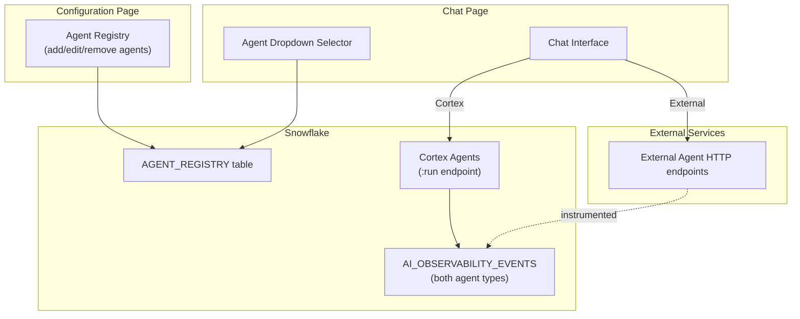

# Plan: Multi-Agent Configuration and Selector

## Context

The app currently hardcodes a single Cortex Agent (`ROI_DEMO_AGENT`). We need to support:

- Multiple Cortex Agents in the same or different accounts
- External/third-party agents instrumented with TruLens (observability-only OR live chat)
- A configuration page to register and manage agents
- An agent selector in the chat UI

Configuration stored in a Snowflake table (`AGENT_REGISTRY`) with a local JSON fallback for offline dev.

### Agent modes per type

| Agent Type                          | Live Chat                          | Observability/Traces                                       | Feedback                               |
| ----------------------------------- | ---------------------------------- | ---------------------------------------------------------- | -------------------------------------- |
| Cortex Agent                        | Yes (via `:run` SSE endpoint)      | Yes (GET\_AI\_OBSERVABILITY\_EVENTS with 'CORTEX AGENT')   | Yes (`:feedback` endpoint)             |
| External Agent (with endpoint)      | Yes (via configured HTTP endpoint) | Yes (GET\_AI\_OBSERVABILITY\_EVENTS with 'EXTERNAL AGENT') | Yes (via observability or custom)      |
| External Agent (observability-only) | No                                 | Yes (traces only)                                          | Manual (write feedback events via SDK) |

### Future master agent considerations

The dropdown selector is designed so a future "router agent" is just another entry in the registry with a special flag (`is_router: true`). When selected, it would receive all messages and internally delegate to other registered agents. The registry table has a `routing_description` field that would feed the router's tool descriptions.

---

## Architecture



---

## Data Model: Agent Registry

**Snowflake table: `AGENT_ROI_DEMO.APP.AGENT_REGISTRY`**

```sql
CREATE TABLE AGENT_REGISTRY (
  id              VARCHAR PRIMARY KEY DEFAULT UUID_STRING(),
  name            VARCHAR NOT NULL,          -- Display name
  slug            VARCHAR NOT NULL UNIQUE,   -- URL-safe identifier
  agent_type      VARCHAR NOT NULL,          -- 'cortex_agent' | 'external_agent'
  mode            VARCHAR NOT NULL,          -- 'live_chat' | 'observability_only'

  -- Cortex Agent fields
  sf_database     VARCHAR,                   -- e.g., 'AGENT_ROI_DEMO'
  sf_schema       VARCHAR,                   -- e.g., 'APP'
  sf_agent_name   VARCHAR,                   -- e.g., 'ROI_DEMO_AGENT'

  -- External Agent fields
  endpoint_url    VARCHAR,                   -- e.g., 'https://my-agent.example.com/chat'
  endpoint_method VARCHAR DEFAULT 'POST',    -- HTTP method
  auth_type       VARCHAR,                   -- 'bearer' | 'api_key' | 'none'
  auth_secret_key VARCHAR,                   -- Reference to secret (not the value)

  -- External Agent observability fields
  obs_database    VARCHAR,                   -- DB where External Agent object lives
  obs_schema      VARCHAR,                   -- Schema
  obs_agent_name  VARCHAR,                   -- External Agent object name

  -- Shared fields
  description     VARCHAR,                   -- What this agent does
  routing_description VARCHAR,              -- For future router: "Use for X questions"
  is_default      BOOLEAN DEFAULT FALSE,    -- Which agent is pre-selected
  is_active       BOOLEAN DEFAULT TRUE,     -- Can be disabled without deletion
  created_at      TIMESTAMP_LTZ DEFAULT CURRENT_TIMESTAMP(),
  updated_at      TIMESTAMP_LTZ DEFAULT CURRENT_TIMESTAMP()
);
```

**Local fallback: `app/config/agents.json`**

Same schema as array of objects. App reads from Snowflake first; falls back to local JSON if the query fails.

---

## Implementation Steps

### Step 1: Create the AGENT\_REGISTRY table and seed it

Create the table in Snowflake and insert the two existing agents (ROI\_DEMO\_AGENT and TRACE\_ANALYST\_AGENT) as initial entries.

**File: `snowflake/11_agent_registry.sql`**

### Step 2: Create the local fallback config

**File: `app/config/agents.json`**

JSON array with the same two agents pre-configured. Used when Snowflake is unreachable.

### Step 3: Agent registry API routes

**Files:**

- `app/src/app/api/agents/route.ts` — GET (list all), POST (create new)
- `app/src/app/api/agents/[slug]/route.ts` — GET (single), PUT (update), DELETE

These read/write to the Snowflake `AGENT_REGISTRY` table. On read failure, fall back to local JSON.

### Step 4: Refactor the agent run API route

**Replace:** `app/src/app/api/agent/run/route.ts` **With:** `app/src/app/api/agent/[slug]/run/route.ts`

Dynamic route that:

1. Looks up agent config by slug from registry
2. If `agent_type === 'cortex_agent'`: calls `https://<host>/api/v2/databases/{db}/schemas/{schema}/agents/{name}:run` (existing logic)
3. If `agent_type === 'external_agent'` with `mode === 'live_chat'`: calls the configured `endpoint_url` with appropriate auth
4. Streams the response back (handles both SSE from Cortex and whatever format the external agent returns)

### Step 5: Refactor the feedback API route

**Replace:** `app/src/app/api/agent/feedback/route.ts` **With:** `app/src/app/api/agent/[slug]/feedback/route.ts`

Looks up agent config, routes feedback to the correct endpoint.

### Step 6: Configuration page

**File: `app/src/app/config/page.tsx`**

UI with:

- List of registered agents (cards showing name, type, mode, status)

- "Add Agent" button that opens a form

- Form fields adapt based on agent\_type selection:

  - Cortex Agent: database, schema, agent name
  - External Agent: endpoint URL, auth type, observability object coordinates

- Edit/delete per agent

- Toggle active/inactive

- Set default agent

### Step 7: Chat page agent selector

**Modify: `app/src/app/chat/page.tsx`**

- Fetch agent list from `/api/agents` on mount
- Render a dropdown in the input area (left of the text input)
- Selected agent determines which `/api/agent/[slug]/run` endpoint is called
- Agents with `mode === 'observability_only'` are excluded from the selector
- Persist last-selected agent in localStorage

### Step 8: Refactor traces page for multi-agent

**Modify: `app/src/app/traces/page.tsx`**

- Add agent dropdown filter at the top

- The span query parameterizes `database`, `schema`, `agent_name`, and `agent_type` from the selected agent's registry config

- Span name classification becomes a mapping function that checks agent\_type:

  - Cortex: existing hardcoded mapping (ReasoningAgentStepPlanning -> PLANNING, etc.)
  - External: use the span name directly as the label, classify by TruLens conventions (spans with `RETRIEVAL` in attributes -> TOOL\_SEARCH, etc.)

### Step 9: Refactor dashboard for multi-agent

**Modify: `app/src/app/dashboard/page.tsx`**

- Add agent filter dropdown (or show all agents aggregated)
- The ROI summary view needs to be parameterized or show per-agent breakdown
- Cost attribution: for external agents, check if they use Cortex LLMs (costs still in CORTEX\_AI\_FUNCTIONS\_USAGE\_HISTORY) or external LLMs (no cost data available)

### Step 10: Add Config nav link to layout

**Modify: `app/src/app/layout.tsx`**

Add "Config" to the navigation bar.

### Step 11: Regression test with existing ROI\_DEMO\_AGENT

Verify that all existing functionality still works end-to-end after the refactoring:

1. **Chat:** Select ROI\_DEMO\_AGENT from dropdown, send "What is total revenue by region?" — confirm streaming response with markdown table renders correctly
2. **Chat:** Send "What is our refund policy?" — confirm Search tool is invoked, response streams
3. **Feedback:** Click thumbs-up on a response, submit with 4 stars — confirm 200 response from feedback API
4. **Feedback:** Click thumbs-down, select "Wrong answer" category, add comment — confirm submission
5. **Task flow:** Click Task Start, chat with agent, click Complete, fill out form, submit — confirm task:start and task:complete events appear in observability
6. **Reasoning:** Verify "View reasoning" collapsible shows planning/thinking steps during a response
7. **Dashboard:** Navigate to /dashboard — confirm metric cards render with data, daily breakdown table populated
8. **Traces:** Navigate to /traces — confirm trace list loads, clicking a trace shows Gantt waterfall
9. **Trace details:** Expand a SQL Exec span — confirm SQL query, verified\_query\_used, and async query stats load
10. **Trace feedback:** Verify feedback section appears below trace total with categories visible
11. **Trace Analyst:** Click "Ask AI", ask "What is the average latency by tool?" — confirm sidebar streams a response
12. **Config page:** Verify both seeded agents appear in the config list with correct type/mode/status

**Automated check (run from terminal):**

```bash
# Verify agent still responds
curl -s -X POST http://localhost:3000/api/agent/roi-demo-agent/run \
  -H "Content-Type: application/json" \
  -d '{"messages":[{"role":"user","content":"What is total revenue?"}]}' | head -5

# Verify feedback still works
curl -s -X POST http://localhost:3000/api/agent/roi-demo-agent/feedback \
  -H "Content-Type: application/json" \
  -d '{"positive":true,"categories":["stars:5"]}'

# Verify trace analyst still responds
curl -s -X POST http://localhost:3000/api/agent/trace-analyst/run \
  -H "Content-Type: application/json" \
  -d '{"messages":[{"role":"user","content":"How many errors in the last 7 days?"}]}' | head -5
```

---

## External Agent Response Format

For external agents with live chat, we need a standard response format. Two options the route handler supports:

**Option A: SSE (same as Cortex)**

```
event: response.text.delta
data: {"text": "Here is the answer..."}

event: done
data: {}
```

**Option B: JSON response (non-streaming)**

```json
{ "response": "Here is the answer...", "metadata": {...} }
```

The run route handler detects which format based on the `Content-Type` response header and normalizes it to SSE for the client.

---

## Future Router Agent

When ready to add a master/router agent:

1. Create a new Cortex Agent with generic tools that map to registered agents
2. Register it in `AGENT_REGISTRY` with a special field (e.g., `is_router: true`)
3. Its orchestration instructions reference `routing_description` from all other registered agents
4. In the chat UI, it appears as the first/default option in the dropdown
5. When selected, the app calls it like any other Cortex Agent — it internally delegates via tool calls

No structural changes needed — it's just another agent in the registry.

---

## Critical Files

- `snowflake/11_agent_registry.sql` — Registry table DDL + seed data
- `app/src/app/api/agent/[slug]/run/route.ts` — Dynamic agent routing (Cortex vs external)
- `app/src/app/config/page.tsx` — Configuration UI for managing agents
- `app/src/app/chat/page.tsx` — Agent selector dropdown integration
- `app/src/app/traces/page.tsx` — Multi-agent trace filtering + flexible span classification

---

## Verification

1. Config page lists both pre-seeded agents (ROI\_DEMO\_AGENT, TRACE\_ANALYST\_AGENT)
2. Adding a new agent via the form persists to AGENT\_REGISTRY table
3. Chat dropdown shows active agents with `mode = 'live_chat'`
4. Selecting a different agent in chat routes messages correctly
5. Traces page can filter by agent and shows spans for each
6. Adding an external agent (observability-only) shows its traces but not in chat selector
7. Deleting/deactivating an agent removes it from selectors but preserves historical trace data
8. Full regression: all 12 checks in Step 11 pass for the existing ROI\_DEMO\_AGENT
