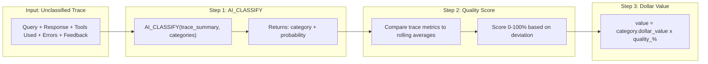

# Plan: Outcomes Tracking Page

## Context

The user wants a new page to track and value agent conversation outcomes using:
- **AI_CLASSIFY** (Cortex AI function) to determine which outcome category a trace belongs to
- **Rolling-average heuristics** to assign a quality percentage (0-100%) based on how a trace compares to the norm for its category
- **Dollar value = category_value x quality_%** — so a "Question Answered" outcome worth $100 at 70% quality = $70 actual value
- **Manual "Classify" button** that incrementally processes unclassified traces
- **Per-agent categories** configured in the Agent Config page

### Classification Pipeline



### How AI_CLASSIFY Works Here

```sql
SELECT 
  trace_id,
  AI_CLASSIFY(
    trace_summary,  -- "User asked: X. Agent responded: Y. Tools: SQL, Search. Errors: none. Feedback: thumbs_up"
    ARRAY_CONSTRUCT('Question Answered', 'Policy Clarified', 'Failed/Error', 'Partial Answer')
  ) AS classified_outcome
FROM unclassified_traces;
```

AI_CLASSIFY returns the best-matching category from the array. The trace_summary is built from:
- User's original query
- Agent's final response (first 500 chars)
- Tools used (Analyst, Search, Chart)
- Error/re-plan signals
- Feedback signal (thumbs up/down/none)

### Quality Score: Rolling Average Approach

For each outcome category, maintain running statistics:
- `avg_latency_ms` — mean latency for traces in this category
- `avg_replan_count` — mean re-plans
- `avg_span_count` — mean number of spans
- `error_rate` — % of traces with errors

Quality score for a new trace = weighted deviation from these norms:
```
quality = 1.0
  - 0.15 if latency > 2x avg_latency
  - 0.10 if replan_count > avg_replan_count + 1
  - 0.25 if has_error
  - 0.10 if no_response_generated
  + 0.10 if has_positive_feedback (bonus)
```

These baselines recalculate each time classification runs (rolling over last 30 days of classified traces).

### Data Model

**OUTCOME_CATEGORIES** — per-agent configurable outcome types:
```sql
CREATE TABLE OUTCOME_CATEGORIES (
  id VARCHAR DEFAULT UUID_STRING() PRIMARY KEY,
  agent_slug VARCHAR NOT NULL,
  category_name VARCHAR NOT NULL,
  category_type VARCHAR NOT NULL,  -- success, failure, partial, neutral
  dollar_value NUMBER(10,2) DEFAULT 0,
  color VARCHAR DEFAULT '#6b7280',
  sort_order NUMBER DEFAULT 0,
  created_at TIMESTAMP DEFAULT CURRENT_TIMESTAMP(),
  UNIQUE(agent_slug, category_name)
);
```

**AGENT_OUTCOMES** — classified outcome per trace:
```sql
CREATE TABLE AGENT_OUTCOMES (
  id VARCHAR DEFAULT UUID_STRING() PRIMARY KEY,
  trace_id VARCHAR NOT NULL UNIQUE,
  agent_slug VARCHAR NOT NULL,
  category_id VARCHAR NOT NULL,
  classification_method VARCHAR NOT NULL,  -- ai_classify, feedback, manual
  feedback_signal VARCHAR,                 -- thumbs_up, thumbs_down, none
  ai_classify_probability NUMBER(5,4),     -- confidence from AI_CLASSIFY
  quality_score NUMBER(5,4) DEFAULT 1.0,   -- 0.0 to 1.0 (from heuristics)
  computed_value NUMBER(10,2),             -- category.dollar_value * quality_score
  trace_summary VARCHAR,                   -- input text sent to AI_CLASSIFY
  override_reason VARCHAR,
  classified_at TIMESTAMP DEFAULT CURRENT_TIMESTAMP(),
  overridden_at TIMESTAMP
);
```

**OUTCOME_BASELINES** — rolling averages per category (recalculated on each classify run):
```sql
CREATE TABLE OUTCOME_BASELINES (
  agent_slug VARCHAR NOT NULL,
  category_id VARCHAR NOT NULL,
  avg_latency_ms NUMBER(10,2),
  avg_replan_count NUMBER(5,2),
  avg_span_count NUMBER(5,2),
  error_rate NUMBER(5,4),
  sample_count NUMBER,
  last_updated TIMESTAMP DEFAULT CURRENT_TIMESTAMP(),
  PRIMARY KEY(agent_slug, category_id)
);
```

### Page Layout

```
+-------------------------------------------------------------------+
| OUTCOMES                          [Agent Filter] [Last 7d / 30d]  |
+-------------------------------------------------------------------+
| +------------+ +------------+ +------------+ +------------------+ |
| | Total Value| | Success %  | | Classified | | Avg Quality      | |
| | $12,450    | | 87%        | | 249 / 280  | | 82%              | |
| +------------+ +------------+ +------------+ +------------------+ |
+-------------------------------------------------------------------+
| [Classify Unclassified (31 pending)]              [Export CSV]     |
+-------------------------------------------------------------------+
| Trace | Agent | Time | Query | Outcome | Quality | Value | Method |
|-------|-------|------|-------|---------|---------|-------|--------|
| 01c5..| Sales | 7/10 | "Rev" | Answered|  92%   | $46   | AI     |
| 01c4..| RAG   | 7/10 | "Ref" | Resolved|  70%   | $52.50| AI     |
| 01c3..| Local | 7/9  | "Cap" | Failed  |  100%  | -$10  | fdbk   |
|       |       |      |       | [v dropdown to override]          |
+-------------------------------------------------------------------+
```

---

## Implementation Steps

### Step 1: Create Snowflake tables and seed data

Create `snowflake/14_outcomes.sql` with:
- OUTCOME_CATEGORIES table + seed categories for all 4 existing agents
- AGENT_OUTCOMES table
- OUTCOME_BASELINES table
- Default categories per agent:
  - Sales & Policy: "Question Answered" ($50), "Policy Clarified" ($30), "Chart Generated" ($40), "Partial Answer" ($15), "Failed" (-$10)
  - Knowledge RAG: "Issue Resolved" ($75), "Info Retrieved" ($40), "Failed" (-$10)
  - Local QA: "Question Answered" ($25), "Partial Answer" ($10), "Failed" (-$5)
  - Trace Analyst: "Insight Provided" ($60), "Query Answered" ($40), "Failed" (-$10)

### Step 2: Build classification API

`POST /api/outcomes/classify` endpoint that:
1. Queries unclassified traces (trace_ids NOT IN AGENT_OUTCOMES)
2. For each trace, builds a summary string (query + response + tools + errors + feedback)
3. Calls `AI_CLASSIFY(summary, categories_array)` via Snowflake SQL
4. Calculates quality score using rolling baselines
5. Computes `value = category.dollar_value * quality_score`
6. INSERTs results into AGENT_OUTCOMES
7. Updates OUTCOME_BASELINES with new rolling averages
8. Returns count of newly classified traces

### Step 3: Categories CRUD API

- `GET /api/outcomes/categories?agent_slug=X` — list categories for an agent
- `POST /api/outcomes/categories` — create a new category
- `PUT /api/outcomes/categories/[id]` — update name, dollar value, type
- `DELETE /api/outcomes/categories/[id]` — remove a category

### Step 4: Outcomes listing API

- `GET /api/outcomes?agent_slug=X&days=7` — list classified outcomes with category details
- `PUT /api/outcomes/[id]` — manual override (change category, set override_reason)
- `GET /api/outcomes/summary?agent_slug=X&days=7` — aggregate metrics for cards

### Step 5: Build Outcomes page

`app/src/app/outcomes/page.tsx`:
- Summary metric cards (total value, success %, classified count, avg quality)
- "Classify Unclassified" button with pending count badge
- Filterable/sortable trace table with:
  - Trace ID (truncated, clickable → links to traces page)
  - Agent name + type badge
  - Timestamp
  - Query preview (first 60 chars)
  - Outcome category (colored badge)
  - Quality % (progress bar)
  - Dollar value
  - Method badge (AI/feedback/manual)
  - Override dropdown (shows all categories for that agent)
- Agent multi-select filter
- Time period filter

### Step 6: Extend Agent Config with outcome categories

Add to `app/src/app/config/page.tsx`:
- Collapsible "Outcome Categories" section per agent
- Table: Name | Type (success/failure/partial) | Dollar Value | Color | Actions
- Inline editing of dollar value
- Add/delete category buttons
- Type selector dropdown

### Step 7: Navigation and integration

- Add "Outcomes" link to nav bar
- Add TypeScript interfaces to `types/index.ts`
- Wire the "Classify" button to show progress/spinner during AI_CLASSIFY execution

---

## How AI_CLASSIFY is Called (SQL Detail)

```sql
-- Build trace summaries and classify in one query
WITH unclassified AS (
  SELECT 
    t.trace_id,
    t.agent_slug,
    t.user_query,
    LEFT(t.response_text, 500) AS response_preview,
    t.tools_used,
    t.has_error,
    t.replan_count,
    t.latency_ms,
    t.feedback_signal
  FROM V_TRACE_SUMMARIES t
  WHERE t.trace_id NOT IN (SELECT trace_id FROM AGENT_OUTCOMES)
),
summaries AS (
  SELECT 
    trace_id, agent_slug,
    CONCAT(
      'User query: ', user_query, '. ',
      'Agent response: ', COALESCE(response_preview, 'none'), '. ',
      'Tools used: ', COALESCE(tools_used, 'none'), '. ',
      'Errors: ', IFF(has_error, 'yes', 'none'), '. ',
      'Re-plans: ', replan_count, '. ',
      'Feedback: ', COALESCE(feedback_signal, 'none')
    ) AS trace_summary
  FROM unclassified
)
SELECT 
  s.trace_id,
  s.agent_slug,
  s.trace_summary,
  AI_CLASSIFY(
    s.trace_summary,
    (SELECT ARRAY_AGG(category_name) FROM OUTCOME_CATEGORIES WHERE agent_slug = s.agent_slug)
  ):label::VARCHAR AS outcome_label,
  AI_CLASSIFY(
    s.trace_summary,
    (SELECT ARRAY_AGG(category_name) FROM OUTCOME_CATEGORIES WHERE agent_slug = s.agent_slug)
  ):probability::NUMBER(5,4) AS probability
FROM summaries s;
```

---

## Verification

1. Run `snowflake/14_outcomes.sql` — verify tables and seed data
2. Navigate to Config → verify categories section appears per agent
3. Navigate to Outcomes → verify "31 pending" count (or however many unclassified)
4. Click "Classify" → verify traces get classified (check AGENT_OUTCOMES table)
5. Verify quality scores are reasonable (70-100% for clean traces, lower for error traces)
6. Verify dollar values = category_value x quality_score
7. Override one outcome → verify it persists and method changes to "manual"
8. Check summary cards reflect correct aggregations

## Critical Files

- `snowflake/14_outcomes.sql` — Table DDL, seed categories, and a helper view V_TRACE_SUMMARIES
- `app/src/app/outcomes/page.tsx` — Main Outcomes page (new)
- `app/src/app/api/outcomes/classify/route.ts` — AI_CLASSIFY orchestration logic
- `app/src/app/api/outcomes/categories/route.ts` — Categories CRUD
- `app/src/app/config/page.tsx` — Extended with outcome categories section
- `app/src/types/index.ts` — New interfaces (OutcomeCategory, AgentOutcome, OutcomeSummary)
