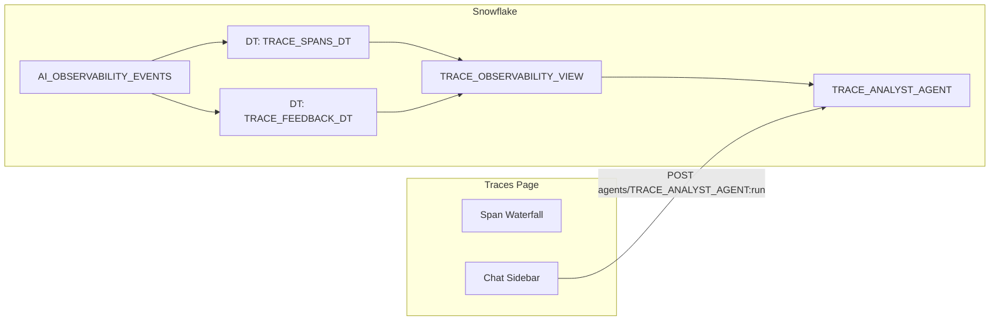

# Plan: Trace Analyst Agent

## Context

The user wants an agent that can answer questions about observability data — both for individual traces and across traces. The agent lives in Snowflake as a second Cortex Agent, and the UI is a collapsible chat sidebar on the existing traces page. We use **dynamic tables** (not tasks) to materialize the observability data for the semantic view.

### Why dynamic tables over tasks

|                   | Dynamic Tables                             | Tasks                       |
| ----------------- | ------------------------------------------ | --------------------------- |
| Refresh logic     | Declarative (Snowflake manages)            | Imperative (you write CTAS) |
| Efficiency        | Incremental when possible                  | Full rebuild every time     |
| Freshness control | `TARGET_LAG = '5 minutes'`                 | `SCHEDULE = '5 MINUTE'`     |
| State management  | None needed                                | Resume/suspend/monitor      |
| Failure handling  | Built-in retry                             | Manual error handling       |
| Appropriate for   | Append-only sources (observability events) | Complex multi-step ETL      |

**Caveat:** If `GET_AI_OBSERVABILITY_EVENTS` table function is not supported as a dynamic table source, we fall back to a task. This will be tested during implementation.

### Architecture



---

## Implementation Steps

### Step 1: Create dynamic tables from observability views

**File: `snowflake/08_trace_tables.sql`**

```sql
-- Dynamic table for spans (refreshes when new data arrives, within 5 min)
CREATE OR REPLACE DYNAMIC TABLE AGENT_ROI_DEMO.APP.TRACE_SPANS_DT
  TARGET_LAG = '5 minutes'
  WAREHOUSE = AGENT_ROI_WH
AS
SELECT
  trace_id, span_id, span_name, RECORD_TYPE, span_kind, tool_name,
  span_duration_ms, is_replan, has_error, error_message,
  start_timestamp, end_timestamp
FROM AGENT_ROI_DEMO.APP.V_AGENT_SPANS;

-- Dynamic table for feedback
CREATE OR REPLACE DYNAMIC TABLE AGENT_ROI_DEMO.APP.TRACE_FEEDBACK_DT
  TARGET_LAG = '5 minutes'
  WAREHOUSE = AGENT_ROI_WH
AS
SELECT
  trace_id, request_id, thread_id, positive, feedback_message,
  event_type, stars, task_value, time_saved, automated, submitted_at
FROM AGENT_ROI_DEMO.APP.V_AGENT_FEEDBACK;
```

If dynamic tables fail on the view (due to the underlying table function), fallback:

```sql
-- Fallback: use a task instead
CREATE OR REPLACE TASK AGENT_ROI_DEMO.APP.REFRESH_TRACE_DATA
  WAREHOUSE = AGENT_ROI_WH SCHEDULE = '5 MINUTE'
AS BEGIN
  CREATE OR REPLACE TABLE AGENT_ROI_DEMO.APP.TRACE_SPANS_DT AS SELECT * FROM AGENT_ROI_DEMO.APP.V_AGENT_SPANS;
  CREATE OR REPLACE TABLE AGENT_ROI_DEMO.APP.TRACE_FEEDBACK_DT AS SELECT * FROM AGENT_ROI_DEMO.APP.V_AGENT_FEEDBACK;
END;
ALTER TASK AGENT_ROI_DEMO.APP.REFRESH_TRACE_DATA RESUME;
```

### Step 2: Semantic view over trace data

**File: `snowflake/09_trace_semantic_view.sql`**

Semantic view over TRACE\_SPANS\_DT and TRACE\_FEEDBACK\_DT:

- **Tables:** trace\_spans (TRACE\_SPANS\_DT), trace\_feedback (TRACE\_FEEDBACK\_DT)

- **Dimensions:**

  - trace\_spans: trace\_id, span\_kind, tool\_name, is\_replan, has\_error, start\_timestamp
  - trace\_feedback: event\_type, positive, stars, task\_value, time\_saved, automated, submitted\_at

- **Metrics:**

  - trace\_spans: span\_count, error\_count, replan\_count, avg\_duration\_ms, max\_duration\_ms, distinct\_trace\_count
  - trace\_feedback: positive\_count, negative\_count, avg\_stars, task\_complete\_count

- **Verified queries:** 6-8 covering:

  - "What is the average latency by tool?"
  - "How many errors in the last 7 days?"
  - "Show all negative feedback with comments"
  - "What percentage of requests have replans?"
  - "What's the breakdown of thumbs-down categories?"
  - "Which tool has the highest error rate?"
  - "Average stars rating for completed tasks"

### Step 3: Create TRACE\_ANALYST\_AGENT

**File: `snowflake/10_trace_agent.sql`**

```yaml
models:
  orchestration: auto
instructions:
  response: |
    You are an agent performance analyst. Your job is to analyze trace data and user feedback
    to provide actionable insights about agent behavior. When discussing specific traces,
    reference the trace_id. When summarizing feedback, group by category and suggest concrete
    changes to the primary agent's instructions or tool configuration. Be specific and data-driven.
  orchestration: |
    Use TRACE_ANALYST for all questions about spans, latency, errors, replans, feedback,
    task completions, and agent performance metrics.
tools:
  - tool_spec:
      type: cortex_analyst_text_to_sql
      name: TRACE_ANALYST
      description: "Query agent observability data including spans, latency, errors, replans, user feedback ratings, task completions, and performance metrics"
tool_resources:
  TRACE_ANALYST:
    semantic_view: "AGENT_ROI_DEMO.APP.TRACE_OBSERVABILITY_VIEW"
    execution_environment:
      type: warehouse
      warehouse: AGENT_ROI_WH
```

### Step 4: API route for the trace agent

**File: `app/src/app/api/agent/trace-run/route.ts`**

Same pattern as `/api/agent/run/route.ts` but targets `TRACE_ANALYST_AGENT` instead of `ROI_DEMO_AGENT`.

### Step 5: TraceChat sidebar component

**File: `app/src/components/TraceChat.tsx`**

A collapsible chat sidebar:

- Toggle via a "Ask about traces" button in the traces page header
- When open, takes \~350px on the right side; the waterfall panel shrinks
- Prepends trace context when a trace is selected: "Context: The user is viewing trace {id} ({duration}s, {N} spans, tools used: {list})"
- Streams SSE responses from TRACE\_ANALYST\_AGENT
- Supports multi-turn conversation
- Minimal styling — no feedback buttons needed on this secondary agent

### Step 6: Integrate sidebar into traces page

Modify `app/src/app/traces/page.tsx`:

- Add toggle button in the header: "Ask AI" / "Close"
- Conditionally render `TraceChat` to the right of the waterfall panel
- Pass `selectedTrace` metadata (trace\_id, duration, span summary) to the sidebar
- Adjust flex layout so waterfall compresses when sidebar is open

---

## Critical Files

- `snowflake/08_trace_tables.sql` — Dynamic tables (or task fallback) materializing observability data
- `snowflake/09_trace_semantic_view.sql` — Semantic view the trace agent queries
- `snowflake/10_trace_agent.sql` — TRACE\_ANALYST\_AGENT definition
- `app/src/components/TraceChat.tsx` — Collapsible chat sidebar component
- `app/src/app/traces/page.tsx` — Integration point for the sidebar toggle and layout

---

## Verification

1. Confirm dynamic tables create successfully (or fall back to task if needed)
2. `SELECT COUNT(*) FROM AGENT_ROI_DEMO.APP.TRACE_SPANS_DT` returns rows
3. `DESCRIBE SEMANTIC VIEW AGENT_ROI_DEMO.APP.TRACE_OBSERVABILITY_VIEW` succeeds
4. Test agent: "How many errors in the last 7 days?" returns a data answer
5. Test with context: "Why did this trace have a replan?" with a specific trace selected
6. Verify sidebar opens/closes and the waterfall layout adjusts properly
7. Verify SSE streaming works in the sidebar
