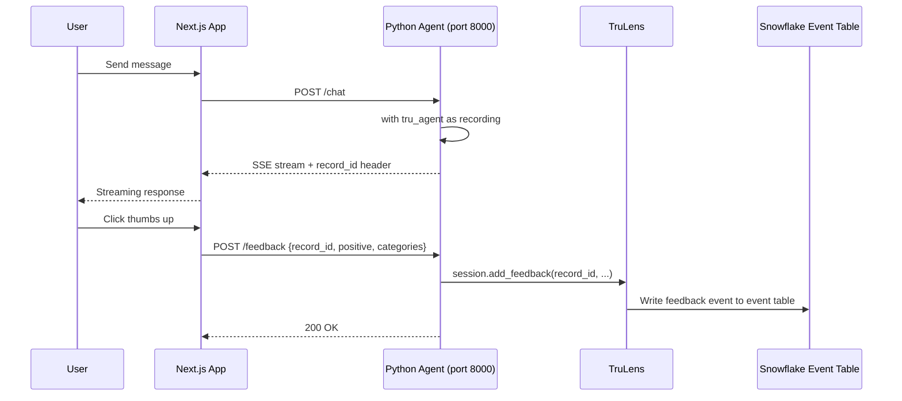

# Plan: TruLens Human Feedback Integration

## Context

The Knowledge RAG Agent (type `cortex_rest_api`) uses a `CREATE EXTERNAL AGENT` object — which does NOT expose the Cortex Agent `:feedback` REST endpoint. Feedback currently fails silently.

TruLens provides `session.add_feedback()` which writes feedback results to the same Snowflake event table as spans, linked by `record_id`. This is the native way to record human feedback for External Agents.

### Data flow



### Key discovery

- `recording.records[0].record_id` returns a UUID after each chat invocation
- `TruSession.add_feedback()` accepts a `FeedbackResult` with `record_id`, `name`, `result` (float 0-1), and metadata
- Feedback written via TruLens appears in `GET_AI_OBSERVABILITY_EVENTS` alongside span data

---

## Implementation Steps

### Step 1: Return record\_id from the Python agent chat endpoint

**File: `external-agent/server.py`**

After `with tru_agent as recording: result = agent(query)`, capture the `record_id`:

```python
record_id = ""
if recording.records:
    record_id = recording.records[0].record_id
```

Return it as a custom SSE event before `done`:

```
event: response.metadata
data: {"record_id": "0861ab8c-af06-43ba-9605-5deaedc85750"}

event: done
data: {}
```

Also include it in the `X-Record-ID` response header for easy access.

### Step 2: Add /feedback endpoint to the Python agent

**File: `external-agent/server.py`**

New endpoint:

```python
@app.post("/feedback")
async def feedback(request: Request):
    body = await request.json()
    record_id = body.get("record_id")
    positive = body.get("positive", True)
    categories = body.get("categories", [])
    message = body.get("feedback_message", "")

    # Map to TruLens feedback result
    result_value = 1.0 if positive else 0.0
    name = "user_feedback"

    # Build a descriptive name from categories
    if "task:start" in categories:
        name = "task_start"
    elif "task:complete" in categories:
        name = "task_complete"
    elif "task:cancelled" in categories:
        name = "task_cancelled"

    feedback_result = FeedbackResult(
        record_id=record_id,
        name=name,
        result=result_value,
        status=FeedbackResultStatus.DONE,
    )
    tru_session.add_feedback(feedback_result)

    return {"status": "Feedback submitted successfully"}
```

### Step 3: Capture record\_id in the Next.js chat page SSE parser

**File: `app/src/app/chat/page.tsx`**

Add parsing for the new `response.metadata` event type:

```typescript
if (currentEvent === 'response.metadata') {
    const data = JSON.parse(dataStr);
    if (data.record_id) {
        // Store record_id on the assistant message (use it for feedback)
        // This acts as the requestId for external agents
    }
}
```

Store the `record_id` in the same `requestId` field on the message — it serves the same purpose (linking feedback to a specific response).

### Step 4: Update Next.js feedback route for cortex\_rest\_api

**File: `app/src/app/api/agent/[slug]/feedback/route.ts`**

For `cortex_rest_api` agents, instead of calling the Snowflake `:feedback` endpoint (which doesn't exist), proxy to the Python agent's `/feedback` endpoint:

```typescript
} else if (agent.agent_type === 'cortex_rest_api') {
    // Proxy feedback to the Python agent's TruLens feedback endpoint
    if (agent.endpoint_url) {
        const feedbackUrl = agent.endpoint_url.replace('/chat', '/feedback');
        const response = await fetch(feedbackUrl, {
            method: 'POST',
            headers: { 'Content-Type': 'application/json' },
            body: JSON.stringify(body),
        });
        if (!response.ok) {
            const errorText = await response.text();
            return NextResponse.json({ error: errorText }, { status: response.status });
        }
        return NextResponse.json({ status: 'Feedback submitted successfully' });
    }
    return NextResponse.json({ status: 'Feedback acknowledged (agent offline)' });
}
```

### Step 5: Pass record\_id in feedback request body

**File: `app/src/app/chat/page.tsx`**

Update the `submitFeedback`, `handleTaskStart`, `handleTaskComplete`, and `handleTaskUndo` functions to include `record_id` in the request body (it's already stored as `requestId` on the message — we just need to send it as `record_id` for external agents):

```typescript
body: JSON.stringify({
    record_id: msg.requestId,       // TruLens record_id (for external agents)
    orig_request_id: msg.requestId, // Snowflake request_id (for Cortex agents)
    positive: feedback.positive,
    categories: feedback.categories || [],
    feedback_message: feedback.message || '',
})
```

Both fields are sent; the backend uses whichever is appropriate for the agent type.

### Step 6: Verify feedback appears in observability events

After submitting feedback:

```sql
SELECT *
FROM TABLE(SNOWFLAKE.LOCAL.GET_AI_OBSERVABILITY_EVENTS(
    'AGENT_ROI_DEMO', 'APP', 'KNOWLEDGE_RAG_AGENT', 'EXTERNAL AGENT'
))
WHERE RECORD_TYPE != 'SPAN'
ORDER BY TIMESTAMP DESC
LIMIT 5;
```

---

## File Changes Summary

| File                                             | Change                                                                          |
| ------------------------------------------------ | ------------------------------------------------------------------------------- |
| `external-agent/server.py`                       | Add `record_id` SSE event + `X-Record-ID` header; add `POST /feedback` endpoint |
| `app/src/app/chat/page.tsx`                      | Parse `response.metadata` SSE event to capture `record_id`                      |
| `app/src/app/api/agent/[slug]/feedback/route.ts` | Route `cortex_rest_api` feedback to Python agent `/feedback` endpoint           |

---

## Critical Files

- `external-agent/server.py` — Adds /feedback endpoint and record\_id emission
- `app/src/app/chat/page.tsx` — Captures record\_id from SSE metadata event
- `app/src/app/api/agent/[slug]/feedback/route.ts` — Routes feedback to correct backend
