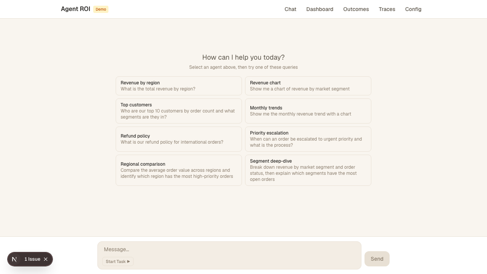
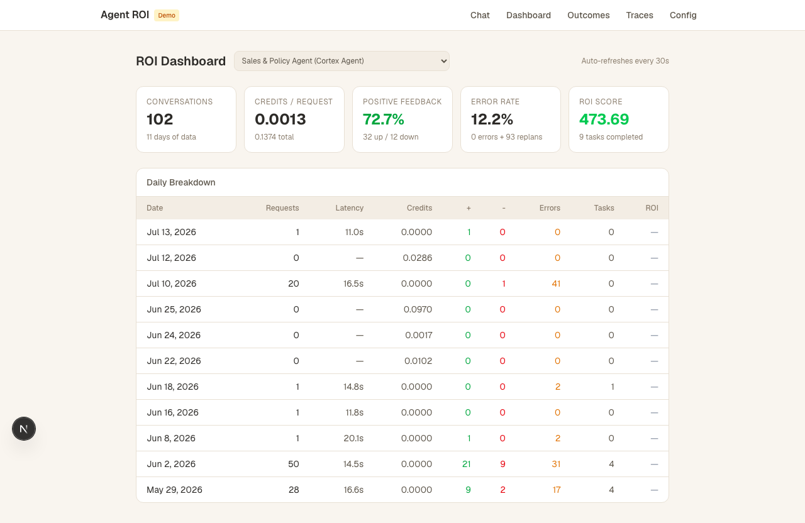
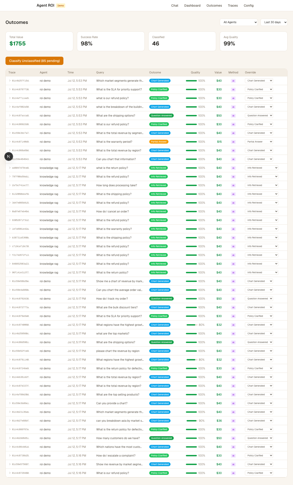
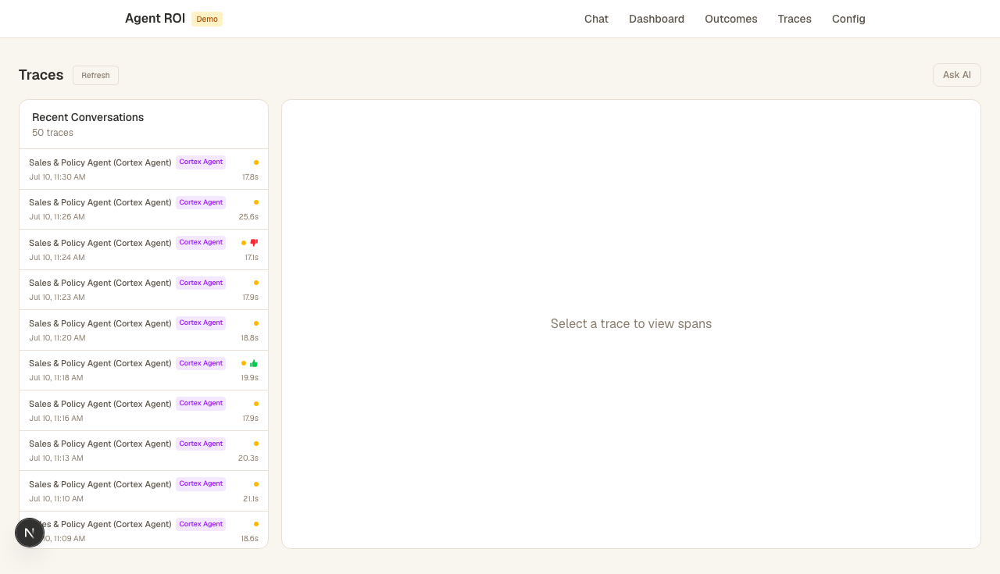
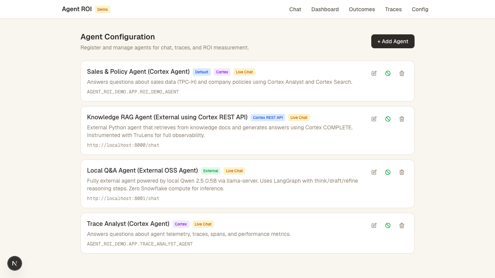
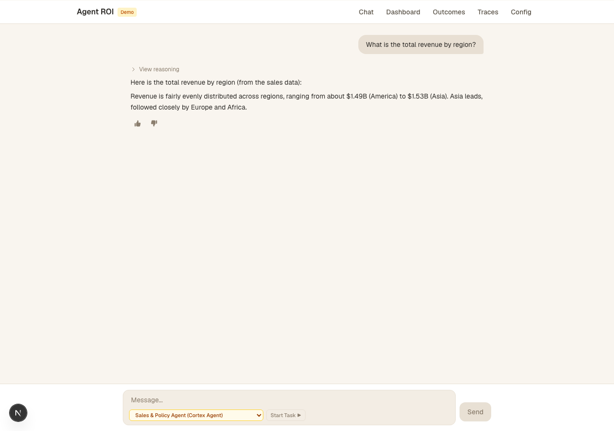
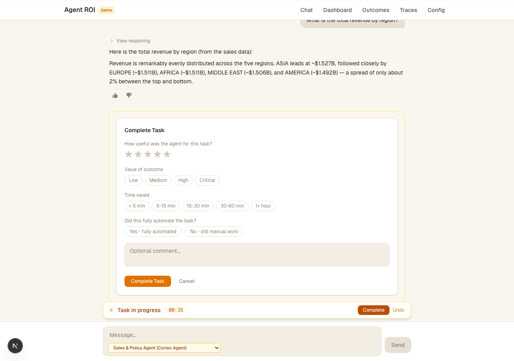
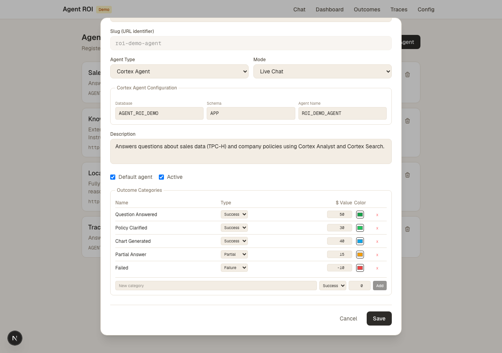

# Agent ROI

A full-stack application for measuring the Return on Investment (ROI) of AI agents built on Snowflake. Monitor conversations, trace execution spans, classify outcomes, and calculate dollar-value impact across multiple agent types.



## What It Does

Agent ROI provides a unified interface to:

- **Chat** with multiple AI agents from a single UI
- **Track costs** — credits consumed, latency, error rates per conversation
- **Trace execution** — view individual spans (planning, tool use, SQL execution, response generation) for every conversation
- **Classify outcomes** — use Snowflake's `AI_CLASSIFY` function to automatically categorize conversation results
- **Calculate ROI** — assign dollar values to outcome categories and compute per-agent return on investment

## Works With Any Agent

Agent ROI is **agent-framework agnostic**. It measures ROI for any AI agent that can report telemetry to Snowflake — whether built natively on Snowflake or running externally in any language or framework.

### Native Snowflake Agents

| Agent Type | Description |
|------------|-------------|
| **Cortex Agent** | Snowflake's native agent framework with built-in Analyst (text-to-SQL) and Search tools |
| **Cortex Analyst** | Text-to-SQL agents built on semantic models |

Native agents get automatic observability — no instrumentation code required.

### External Agents (via TruLens)

Any Python-based agent can report telemetry to Snowflake using [TruLens](https://www.trulens.org/). This project includes two reference implementations, but the pattern extends to **any framework**:

| Framework | Reference Implementation | Description |
|-----------|-------------------------|-------------|
| **LangGraph** | `external-agent/local/` | Graph-based agent orchestration with node-level tracing |
| **Cortex COMPLETE (direct)** | `external-agent/` | RAG agent calling Snowflake Cortex REST API directly |

**Other supported frameworks** (via TruLens instrumentation):

- **LangChain** — `TruChain` instruments every chain step as a span
- **LlamaIndex** — `TruLlama` captures query engine, retrieval, and synthesis spans
- **CrewAI** — instrument multi-agent crew tasks and delegation
- **AutoGen** — capture conversation turns across agent groups
- **Custom Python agents** — `TruCustomApp` decorates any method for span-level tracing
- **Any OpenAI-compatible endpoint** — local models (llama.cpp, Ollama, vLLM), cloud APIs (OpenAI, Anthropic, Cohere) routed through instrumented code

### How External Agent Telemetry Works

```
Your Agent (any framework)
        │
        ▼
TruLens Instrumentation (Python decorator / wrapper)
        │
        ▼
Spans written to Snowflake  ──►  GET_AI_OBSERVABILITY_EVENTS('EXTERNAL AGENT')
        │
        ▼
Agent ROI reads the same unified telemetry format
```

As long as your agent writes spans via TruLens to Snowflake, Agent ROI will automatically pick up traces, calculate costs, classify outcomes, and compute ROI — regardless of the underlying framework or model provider.

## Architecture

```
┌─────────────────────────────────────────────────────────────┐
│                    Next.js Frontend (port 3000)              │
│   Chat │ Dashboard │ Outcomes │ Traces │ Config             │
└────────┬──────────────────────────────────────┬─────────────┘
         │                                      │
         ▼                                      ▼
┌─────────────────┐                   ┌──────────────────────┐
│  Snowflake APIs │                   │  External Agents     │
│  - Cortex Agent │                   │  - RAG Agent (:8000) │
│  - SQL API      │                   │  - Local LLM (:8080) │
│  - AI_CLASSIFY  │                   │  - TruLens telemetry │
└────────┬────────┘                   └──────────┬───────────┘
         │                                       │
         ▼                                       ▼
┌─────────────────────────────────────────────────────────────┐
│                    Snowflake (AGENT_ROI_DEMO)                │
│  - Observability events (GET_AI_OBSERVABILITY_EVENTS)        │
│  - Materialized traces (TRACE_EVENTS_MATERIALIZED)          │
│  - Outcome classifications (AGENT_OUTCOMES)                  │
│  - Agent configs, categories, baselines                      │
└─────────────────────────────────────────────────────────────┘
```

## Pages

### Dashboard

Per-agent ROI metrics: conversations, credits/request, feedback rates, error rates, and daily breakdowns.



### Outcomes

AI-powered outcome classification using `AI_CLASSIFY`. Each trace is categorized (Chart Generated, Policy Clarified, Question Answered, etc.) with configurable dollar values per category. Includes quality scoring and manual override support.



### Traces

Full execution trace viewer. Click any conversation to see individual spans — planning steps, tool calls, SQL executions, and response generation — with timing, token counts, and detailed attributes.



### Config

Register and manage agents. Supports Cortex Agents (native Snowflake), external agents (Cortex REST API with TruLens), and fully local agents (llama-server). Configure outcome categories per agent.



## Telemetry Sources

| Agent Type | Telemetry Source |
|------------|-----------------|
| Native Cortex Agent | `GET_AI_OBSERVABILITY_EVENTS('CORTEX AGENT')` — automatic, no instrumentation needed |
| Any External Agent | `GET_AI_OBSERVABILITY_EVENTS('EXTERNAL AGENT')` — via TruLens instrumentation |

## Prerequisites

- Snowflake account with `ACCOUNTADMIN` role (or role with Cortex AI access)
- A Programmatic Access Token (PAT) for authentication
- Node.js 18+
- Python 3.11+ (for external agents)
- (Optional) llama-server with a GGUF model for the local agent

### Required Permissions for Observability

To view trace details (tool inputs/outputs, conversation history, user feedback), the role used by the app must be granted:

```sql
-- Grant the CORTEX_USER database role (required for any observability access)
GRANT DATABASE ROLE SNOWFLAKE.CORTEX_USER TO ROLE <your_role>;

-- Grant MONITOR on each Cortex Agent you want to observe
GRANT MONITOR ON CORTEX AGENT <db>.<schema>.<agent_name> TO ROLE <your_role>;

-- Grant full (unredacted) observability content — tool I/O, conversation text, feedback
GRANT READ UNREDACTED AI OBSERVABILITY EVENTS TABLE ON ACCOUNT TO ROLE <your_role>;
```

Without `READ UNREDACTED AI OBSERVABILITY EVENTS TABLE`, you can still see metadata (tool names, token counts, latency, model name, error severity) but **not** the actual input/output content of spans.

For External Agents, `USAGE` on the External Agent object is sufficient (no `MONITOR` needed):

```sql
GRANT USAGE ON EXTERNAL AGENT <db>.<schema>.<external_agent_name> TO ROLE <your_role>;
```

## Installation

### 1. Clone the repository

```bash
git clone https://github.com/prabhathn/agent-roi.git
cd agent-roi
```

### 2. Set up Snowflake objects

Run the SQL scripts in order to create the database, tables, and agents:

```bash
# Run each script in Snowsight or via SnowSQL
snowsql -f snowflake/01_setup.sql
snowsql -f snowflake/02_cortex_search.sql
# ... continue through all numbered scripts
snowsql -f snowflake/14_outcomes.sql
```

These scripts create:
- `AGENT_ROI_DEMO` database with `APP` schema
- Cortex Search service on knowledge base documents
- Cortex Agent (`ROI_DEMO_AGENT`) with Analyst + Search tools
- Trace materialization tables and outcome classification tables

### 3. Configure the Next.js app

```bash
cd app
cp .env.example .env.local
```

Edit `.env.local` with your Snowflake credentials:

```env
SNOWFLAKE_ACCOUNT=your-account-identifier
SNOWFLAKE_USER=your-username
SNOWFLAKE_TOKEN_FILE=~/.snowflake/tokens/your_token_file
SNOWFLAKE_DATABASE=AGENT_ROI_DEMO
SNOWFLAKE_SCHEMA=APP
SNOWFLAKE_WAREHOUSE=AGENT_ROI_WH
SNOWFLAKE_ROLE=ACCOUNTADMIN
```

Install dependencies and start:

```bash
npm install
npm run dev
```

The app will be available at http://localhost:3000.

### 4. (Optional) Set up the external RAG agent

```bash
cd external-agent
python -m venv .venv
source .venv/bin/activate
pip install -r requirements.txt
```

Set environment variables:

```bash
export SNOWFLAKE_ACCOUNT=your-account-identifier
export SNOWFLAKE_USER=your-username
export SNOWFLAKE_TOKEN_FILE=~/.snowflake/tokens/your_token_file
```

Start the agent:

```bash
python server.py
# Runs on http://localhost:8000
```

### 5. (Optional) Set up the local LLM agent

Download a GGUF model (e.g., Qwen 2.5 0.5B Instruct Q4):

```bash
# Install llama-server (via Homebrew on macOS)
brew install llama.cpp

# Download a small model
cd external-agent/local
# Place your .gguf model file here

# Start llama-server
llama-server -m your-model.gguf --port 8080 -c 2048
```

Then start the local agent:

```bash
cd external-agent/local
python -m venv .venv
source .venv/bin/activate
pip install -r requirements.txt
python server.py
# Runs on http://localhost:8001
```

## Usage

1. **Register agents** in the Config page — point them at your Snowflake agent or external endpoints
2. **Chat** with agents using the Chat page — ask questions, generate charts
3. **View traces** to understand how the agent processed each request
4. **Classify outcomes** — click "Classify Unclassified" on the Outcomes page to run `AI_CLASSIFY`
5. **Monitor ROI** on the Dashboard — track cost efficiency and value delivered over time

## Key Technologies

- **Snowflake Cortex Agent** — native AI agent with Analyst (text-to-SQL) and Search tools
- **Snowflake AI_CLASSIFY** — zero-shot text classification for outcome categorization
- **TruLens** — open-source LLM observability (TruGraph for LangGraph agents)
- **LangGraph** — graph-based agent orchestration for the local agent
- **Next.js 16** — React framework with Turbopack
- **Vega-Lite** — declarative charting for agent-generated visualizations

## Project Structure

```
agent-roi/
├── app/                    # Next.js frontend application
│   ├── src/app/           # Pages (chat, dashboard, outcomes, traces, config)
│   ├── src/app/api/       # API routes (Snowflake SQL proxy, outcomes, traces)
│   └── src/lib/           # Snowflake auth helpers
├── external-agent/         # External RAG agent (TruLens + Cortex COMPLETE)
│   ├── server.py          # FastAPI server
│   ├── agent.py           # Knowledge RAG agent logic
│   └── local/             # Local LLM agent (LangGraph + llama-server)
├── snowflake/             # SQL DDL scripts (numbered, run in order)
├── scripts/               # Data loading and utility scripts
└── docs/                  # Documentation and screenshots
```

## License

MIT

---

## Appendix A: Snowflake AI Telemetry

Agent ROI leverages two telemetry systems to capture full observability across all agent types.

### Native Snowflake Telemetry (Cortex Agents)

Snowflake provides built-in observability through the `GET_AI_OBSERVABILITY_EVENTS` table function. This captures spans and feedback for any Cortex Agent or External Agent registered with Snowflake.

| View / Function | What it captures |
|----------------|-----------------|
| `GET_AI_OBSERVABILITY_EVENTS('CORTEX AGENT')` | Spans for native Cortex Agents — planning, tool calls (Analyst, Search), SQL execution, response generation |
| `GET_AI_OBSERVABILITY_EVENTS('EXTERNAL AGENT')` | Spans for external agents that report telemetry via TruLens to Snowflake |
| `SNOWFLAKE.ACCOUNT_USAGE.CORTEX_AGENT_USAGE_HISTORY` | Billing: tokens, credits per Cortex Agent conversation |
| `SNOWFLAKE.ACCOUNT_USAGE.AI_FUNCTIONS_USAGE_HISTORY` | Billing: AI function calls (COMPLETE, CLASSIFY, EXTRACT, etc.) |
| `SNOWFLAKE.ACCOUNT_USAGE.CORTEX_SEARCH_USAGE_HISTORY` | Billing: Cortex Search query volume |
| `SNOWFLAKE.ACCOUNT_USAGE.CORTEX_ANALYST_USAGE_HISTORY` | Billing: Cortex Analyst (text-to-SQL) calls |

**Span structure** (from `GET_AI_OBSERVABILITY_EVENTS`):
- Each span has: `trace_id`, `span_id`, `name`, `start_timestamp`, `end_timestamp`, `record_attributes`
- Attributes vary by span type: planning spans include model/tokens, tool spans include tool names and arguments, SQL spans include the query and warehouse
- Feedback events: `positive` (boolean), `categories` (array), `message` (text)

### TruLens Telemetry (External Agents)

For agents built outside Snowflake's native framework, [TruLens](https://www.trulens.org/) provides equivalent observability by instrumenting Python agent code and writing spans to Snowflake.

| Instrumentation | Coverage |
|----------------|----------|
| **TruGraph** (LangGraph agents) | Node-level spans — each graph node (think, draft, refine) gets an individual span with `span_type: "graph_node"` |
| **TruChain** (LangChain agents) | Chain-level spans — each chain step gets a span |
| **TruCustomApp** (Custom agents) | Method-level spans — any decorated method gets instrumented |

TruLens writes its telemetry to the same Snowflake tables that `GET_AI_OBSERVABILITY_EVENTS('EXTERNAL AGENT')` reads from, providing a unified view.

### Materialization Strategy

Calling `GET_AI_OBSERVABILITY_EVENTS` is a table function that scans raw event data on every call. For production dashboards, Agent ROI pre-materializes all events into `TRACE_EVENTS_MATERIALIZED`:

```sql
-- Manual refresh via the app's "Refresh" button
INSERT INTO TRACE_EVENTS_MATERIALIZED
SELECT * FROM TABLE(GET_AI_OBSERVABILITY_EVENTS('CORTEX AGENT', ...))
WHERE START_TIMESTAMP > (SELECT MAX(START_TIMESTAMP) FROM TRACE_EVENTS_MATERIALIZED ...)
```

This reduces page load times from 5-10s to <500ms for the Traces and Outcomes pages.

---

## Appendix B: Outcome Classification

The Outcomes system classifies every agent conversation into business-meaningful categories and assigns dollar values to measure ROI.

### How It Works

1. **Categories are defined per agent** in the Config page. Each has a name, type (success/failure/partial/neutral), and dollar value.
2. **AI_CLASSIFY runs in batch** — Snowflake's `AI_CLASSIFY` function reads the trace summary (query + response + tools used + errors) and picks the best-matching category.
3. **Quality scoring** adjusts the dollar value: errors (-25%), high latency (-10%), re-plans (-10%), thumbs down (-30%), thumbs up (+10%).
4. **Manual override** — humans can re-classify any outcome via the dropdown in the Outcomes table.

### Feedback Collection

Each agent response includes thumbs up/down buttons for direct user feedback. This feedback is stored as an observability event and factors into quality scoring.



### Task Tracking

The "Start Task" button begins a timer that measures how long a user spends on a multi-turn interaction. When they click "Complete," the elapsed time is recorded as a task duration metric.



### Configuring Outcome Categories

Each agent has its own set of categories defined in the Config page. Categories include a dollar value that represents the business impact of that outcome type.



### Classification Flow

```
Trace Summary (query + response + tools + errors)
        │
        ▼
┌──────────────────┐
│   AI_CLASSIFY    │  ← Snowflake Cortex function
│  (zero-shot)     │
└────────┬─────────┘
         │
         ▼
Category Match (e.g. "Chart Generated")
         │
         ▼
Quality Score = 1.0 + adjustments (errors, latency, feedback)
         │
         ▼
Computed Value = Category.dollar_value × Quality Score
```

### Example Categories

| Agent | Category | Type | $ Value |
|-------|----------|------|---------|
| Sales & Policy Agent | Chart Generated | Success | $40 |
| Sales & Policy Agent | Question Answered | Success | $50 |
| Sales & Policy Agent | Policy Clarified | Success | $30 |
| Knowledge RAG Agent | Info Retrieved | Success | $40 |
| Knowledge RAG Agent | No Information Available | Neutral | $0 |
| Local Q&A Agent | Answered | Success | $5 |

